<!-- Please do not change this logo with link -->

# Weak pull-up feature of the GPIO module

This Code example shows how to setup the Weak Pull-up feature of the GPIO.

## Related Documentation

- [MPLAB Code Configurator](https://www.microchip.com/en-us/development-tools-tools-and-software/embedded-software-center/mplab-code-configurator)
- [PIC18-Q43 Family Product Page](https://www.microchip.com/en-us/products/microcontrollers-and-microprocessors/8-bit-mcus/pic-mcus/pic18-q43)
## Software Used

- MPLAB® X IDE 6.0.0 or newer [(MPLAB® X IDE 6.0)](https://www.microchip.com/en-us/development-tools-tools-and-software/mplab-x-ide?utm_source=GitHub&utm_medium=TextLink&utm_campaign=MCU8_MMTCha_MPAE_Examples&utm_content=pic18f57q43-cnano-wpu-mplab-melody-github)
- MPLAB® XC8 2.35.0 or newer compiler [(MPLAB® XC8 2.35)](https://www.microchip.com/en-us/development-tools-tools-and-software/mplab-xc-compilers?utm_source=GitHub&utm_medium=TextLink&utm_campaign=MCU8_MMTCha_MPAE_Examples&utm_content=pic18f57q43-cnano-wpu-mplab-melody-github)
- MPLAB® Code Configurator (MCC) 5.1.0 or newer [(microchip.com/mplab/mplab-code-configurator)](https://www.microchip.com/mplab/mplab-code-configurator)
- MPLAB® Code Configurator (MCC) Melody 2.0.46 or newer [(microchip.com/en-us/tools-resources/configure/mplab-code-configurator/melody)](https://www.microchip.com/en-us/tools-resources/configure/mplab-code-configurator/melody)
- Microchip PIC18F-Q Series Device Support (1.13.211) or newer [(packs.download.microchip.com/)](https://packs.download.microchip.com/)

## Hardware Used

- [Microchip PIC18F57Q43 Curiosity Nano Evaluation Kit](https://www.microchip.com/developmenttools/ProductDetails/DM164150)
- [Microchip Curiosity Nano Base for Click boards](https://www.microchip.com/developmenttools/ProductDetails/AC164162)
- [Breadboard](https://www.mouser.com/ProductDetail/426-FIT0008)
- [Switches](https://www.mouser.com/ProductDetail/506-FSM2JRT)
- [LED](https://www.mouser.com/ProductDetail/941-C5SMFRJECT0W0BB2)
- [Resistor](https://www.mouser.com/ProductDetail/603-CFR-25JB-52-330R)
- [Wire Kit](https://www.mouser.com/ProductDetail/424-WIRE-KIT)

### Hardware User Guide
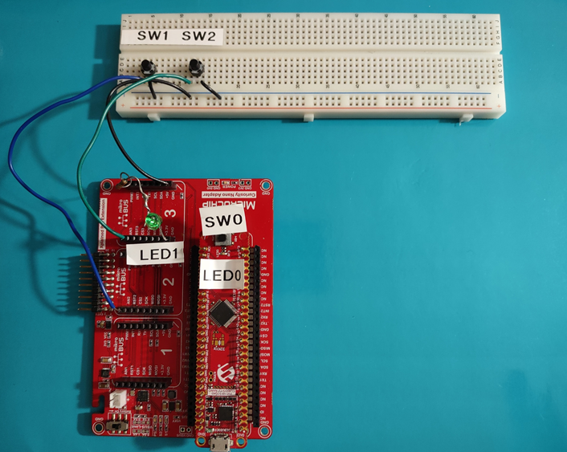</a>

This example code will demonstrate how to set up two push button inputs on the PIC18F57Q43 Nano Development board: one input using the internal weak pull-up and the other without. The example uses two LEDs to indicate when the push buttons are pressed. The materials needed for this example include a bread board and assorted jumper wires to make the necessary connections, and one LED with a resistor connected in series to do this demo using the PIC18F57Q43 curiosity Nano.

## Setup
Attach the PIC18F57Q43 Curiosity Nano to the Curiosity Nano Adapter Board with supplied pins. 
Place the switches in the bread board as shown in the hardware setup figure. Connect one switch to the pin labeled AN2 and the other switch to the pin labeled AN3 on the Curiosity Nano Adapter board. Connect the other pins of both switches to a ground on the Curiosity Nano Adapter board.
There are a few different ways to connect the LED and resistor.  The first option is to solder the LED in series with the resistor, and connect it to the input labeled as PWM3 on the Curiosity Nano adapter. The other end should be connected to ground in this option. It is important to ensure the polarity of the LED is correct (anode to the pin and the cathode towards ground). The second option is to place them into the breadboard and connect them in series similar to option one but with jumper wires going to the Curiosity Nano adapter.
Once this hardware setup has been completed, connect the Curiosity Nano to the PC. 

MCC with the Melody library was used to implement this example as shown in the following section.
## Clock Control Configuration
In the *Project Resources* window select "Clock Control" as shown in the figure below. 

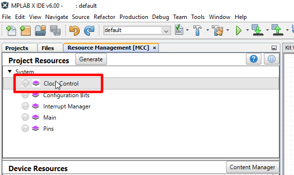

After selecting the "Clock Control" option, a window on the right side of the MPLAB-IDE will appear called *Clock Control Easy View*. Use the Dropdown boxes to select HFINTOSC, 4MHz, and divide by 4 as shown in the figure below.

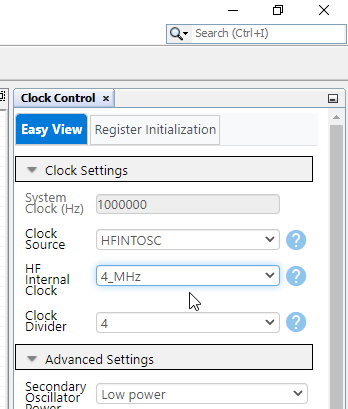

## Pin Configuration
In the *Pins Grid View* window, find RA1 and RA2 which are used as the input pins for SW1 and SW2 respectively. Select these pins by clicking the corresponding padlock symbol as shown in the figure below. Find RA5 which is the pin used for LED1, and find RF3 which is used for LED0. Configure these pins as outputs by clicking the corresponding padlock symbol as shown in the figure below.

**Pins Grid View**

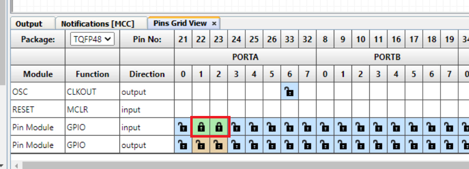
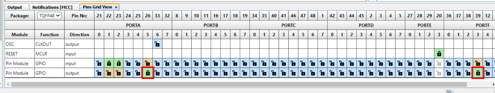
## Pin Control Configuration
In the *Project Resources* window selecting the "Pins" option. 

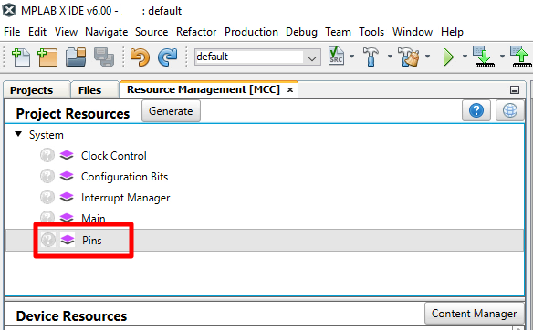

After selecting the "Pins" option, a window on the right side of the MPLAB-IDE will appear called "Pins". Slide the bar on the left side to view more of the window.
De-select the "Analog" checkbox on all pins in this window to disable analog functionality, which is not needed for this example.

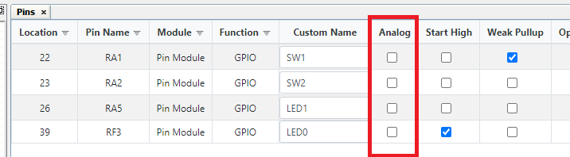

Use the "Custom Name" field to rename pin RA1 to "SW1", pin RA2 to "SW2", pin RA5 to "LED1" and pin RF3 to "LED0".  
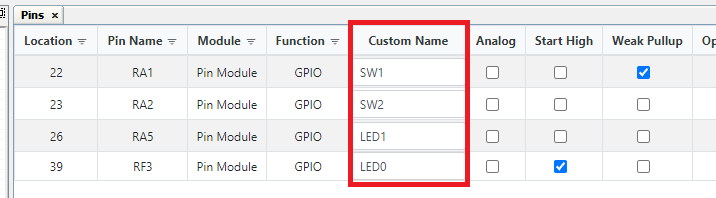

Select the "Start High" option for pin RF3 (LED0), so that the LED does not light up until the button has been pushed.

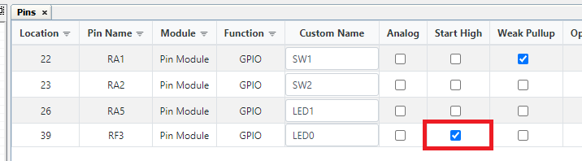

## WPU Configuration
 
Enable weak pull-ups on pin RA1 by selecting the the weak pull-up checkbox as shown below. 

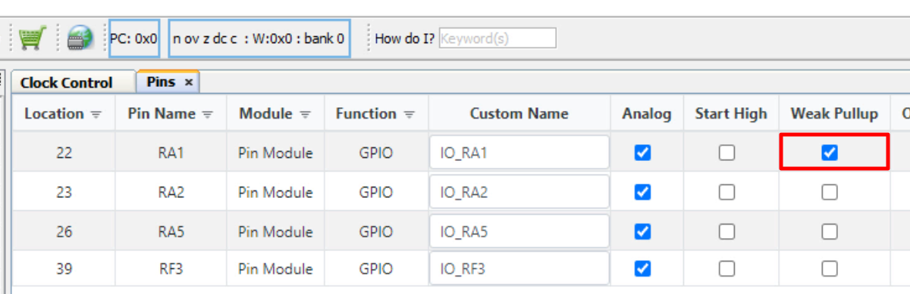

In the *Project Resources* window click the "Generate" button.

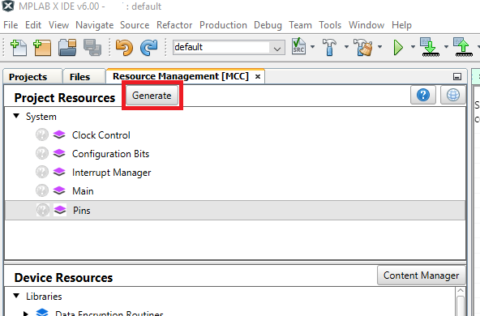

Once the code has been generated by Melody, select the "Clean and Build" button.

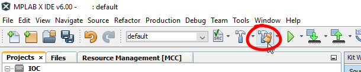

Once the project has been successfully built the output window should show the following message:

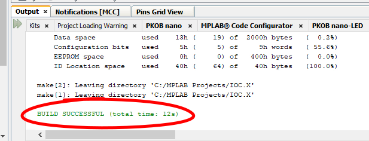

To show the source code Melody generated, expand the source files until you see the pins.c file, and double click on the file name to open it.  Once this file is open, scroll down to find the WPU register setup to see where pin RA1 weak pull-up functionality has been configured.

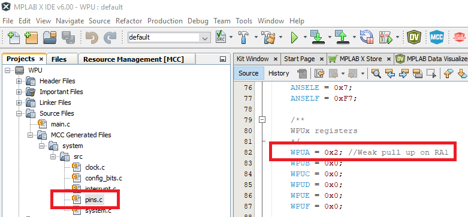

Click on the Projects tab of the MPLAB-IDE and expand the source files until you see main.c. Open this file by double clicking on it.

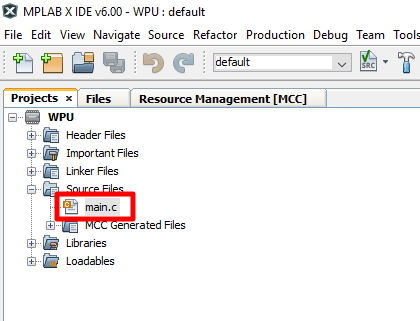

The next step is to copy the code shown below into the main loop. This routine monitors the status of both push buttons, and lights or turns off the respective LEDs based on the inputs given.

        if (SW1_PORT == 0){
            LED0_SetLow();
        }
        else{
            LED0_SetHigh();
        }

        if (SW2_PORT == 0){
            LED1_SetHigh();            
        }
        else{
            LED1_SetLow();            
        }
        
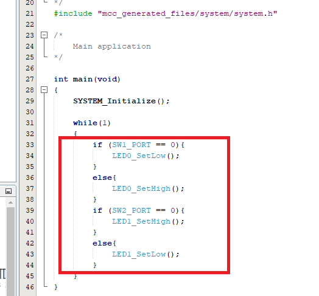

Click the "Clean and Build" button once the routine has been copied into the main loop.

Once the project has been successfully built the output window should show the following message:

Click the "Program Device" button.

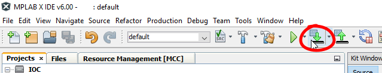

Once the device has been successfully programmed, the output window should show the following message:

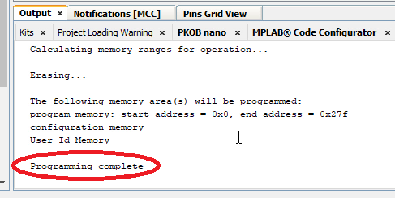
## Operation

To operate the demo press the pushbutton named SW1, and then press the pushbutton named SW2 to observe how the different configurations behave.

This video will show the effects of the weak pull-up feature. When SW1 is pressed, LED0 lights up, and then when it’s released the LED turns off. This is the I/O with weak pull-ups enabled. The weak pull-up pulls the logic signal high when it is not being driven low by the push button, effectively turning off the LED when the button is not being pressed. 
SW2 when pushed lights LED1, but when the pushbutton is released the LED takes significantly longer to shut off because the input doesn’t have weak pull-ups enabled. The input does not pull the floating I/O up immediately in this case, so the LED remains on for a little longer. 
Notice that LED1 lights up sometimes when SW1 is pushed. The pins on the microcontroller are physically right next to each other, and the pin that LED1 is connected to is floating and accepting noise from the pin right next to it. This is another effect of not having a pull-up to bring the pin to a known state.

</a>

## Summary

The example has shown how Melody can be used to easily configure a pin, using the Weak Pull-up feature of the GPIO module module of the PIC18F57Q43 device. 